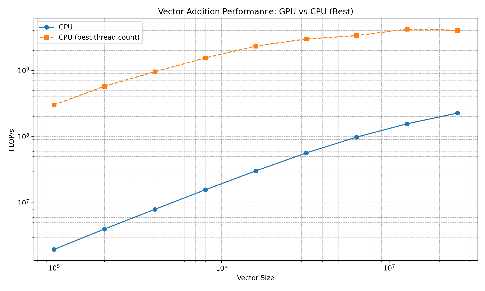
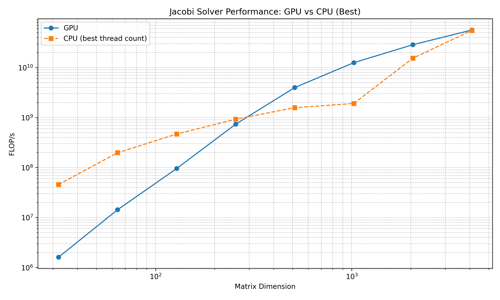

# Project 4 Report
## Joe Baran

### Vector Addition

The vector addition performance graph shows that the CPU consistently outperforms the GPU across all vector sizes, achieving higher FLOP/s, especially for large vectors. The GPU performance increases steadily with vector size, but remains an order of magnitude below the CPU's best performance.

### Jacobi Solver
 

In the Jacobi solver graph, the GPU performance starts lower than the CPU's at small matrix dimensions but rapidly surpasses it as the problem size grows. For large matrices, the GPU delivers FLOP/s comparable to the CPU, showing better scalability.

 ### Summary
 While the CPU is great at vector addition due to its lower overhead and more efficient memory access for simple operations, the GPU excels in the Jacobi solver where parallelism and compute intensity are higher. This highlights the GPU's strength in complex, large-scale numerical methods over memory-bound tasks. Generally, the choice between CPU and GPU depends on the computational characteristics of the task.